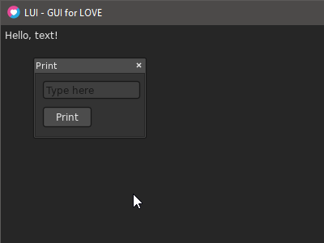

# LUI - pronounced 'Louie'
### Version 0.1.0 (Early alpha - not yet available)

A lightweight retained-mode GUI library for [LÖVE](https://love2d.org/). Get a lovely GUI up and running fast.


### Objective

LUI is the middle-ground between the immediate-mode GUI libraries and the powerhouse GUI libraries:

- Fast: Ready out-of-box for getting a retained UI running very quickly.
- Extendable: Easily create your own UI elements, if preferred.
- Minimalist: Not the end-all/be-all GUI library. Just the fundamental tools you need to create an effective, clean UI.


### Features

- Includes a clean and simple default interface with essentials
- UTF8 support
- Easily customizable
- Hierarchy-based parenting system
- Optional layout anchoring system (COMING SOON)
- Z-Ordering  (COMING SOON)
- Tab indexing (COMING SOON)
- Element rendering is culled outside parent's bounds (togglable, enabled by default) (COMING SOON)
- Many callbacks can be assigned to an element event
- Keyframe value animation system (COMING SOON)


### Example



```lua
lui = require 'lui/lui'

function love.load( )
	txtOutput = lui.new('Text', {
		text = "Hello, text!",
		x    = 5,
		y    = 5,
	})
	wnd = lui.new('Window', {
		title  = "Print",
		x      = 40,
		y      = 40,
		width  = 140,
		height = 100,
	})
	txtInput = wnd:new('TextInput', {
		textPreview = "Type here",
		x           = 10,
		y           = 10,
		width       = 120,
	})
	btnPrint = wnd:new('Button', {
		text   = "Print",
		x      = 10,
		y      = 10 + txtInput.y + txtInput.height,
		width  = 60,
		height = 25,
	})
	btnPrint.onClick = function()
		txtOutput.text = txtInput.text
	end
	love.keyboard.setKeyRepeat(true)
end

function love.update( dt )
	lui.update(dt)
end

function love.draw( )
	love.graphics.clear(0.15, 0.15, 0.15)
	lui.draw()
end

function love.keypressed( key, scancode, isrepeat )
	lui.keypressed(key, scancode, isrepeat)
end

function love.keyreleased( key, scancode )
	lui.keyreleased(key, scancode)
end

function love.textedited( text, start, length )
	lui.textedited(text, start, length)
end

function love.textinput( text )
	lui.textinput(text)
end

function love.mousemoved( x, y, dx, dy, istouch )
	lui.mousemoved(x, y, dx, dy, istouch)
end

function love.mousepressed( x, y, button, istouch, presses )
	lui.mousepressed(x, y, button, istouch, presses)
end

function love.mousereleased( x, y, button, istouch, presses )
	lui.mousereleased(x, y, button, istouch, presses)
end

function love.wheelmoved( x, y )
	lui.wheelmoved(x, y)
end
```
